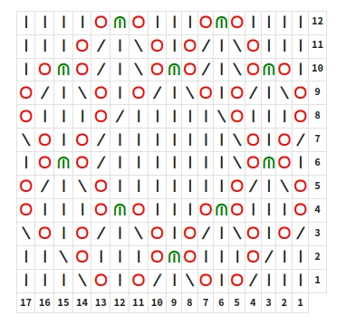

# Knitting plugin

Плагин для отрисовки схем вязания



## Install
- в папке `.obsidian/plugins` создайте `knitting`
- в эту папку перенестите три файла из [releases](https://github.com/dordenis/obsidian-knitting-plugin/releases): 
  - main.js
  - style.css
  - manfest.json
- в настройках Obsidian включите плагин Knitting patterns

## Uses


~~~markdown
```knitting
style: jfont
colors: j-red, b-green
---
ggggjbjgggjbjgggg 
gggj|g\jgj|g\jggg
gjbj|g\jbj|g\jbjg
j|g\jgj|g\jgj|g\j
jgggj|ggggg\jgggj
\jgj|ggggggg\jgj|
gjbj|ggggggg\jbjg
j|g\jgggggggj|g\j
jgggjbjgggjbjgggj
\jgj|g\jgj|g\jgj|
gg\jgggjbjgggj|gg
ggg\jgj|g\jgj|ggg
```
~~~

Список допустимых значений **style**:
- jfont - Knitting Symbols by CET
- kauri - Kauri Knits
- kauri2 - Kauri Knits sans borders

