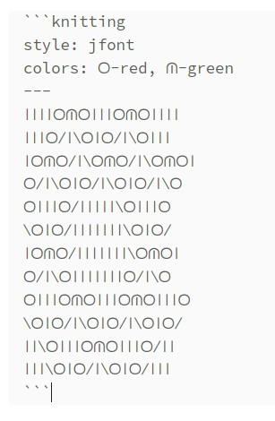

# Knitting plugin

Плагин для отрисовки схем вязания

## Edit mode



## Mode view


## Install
- в папке `.obsidian/plugins` создайте `knitting`
- в эту папку перенестите три файла из [releases](https://github.com/dordenis/obsidian-knitting-plugin/releases): 
  - main.js
  - style.css
  - manfest.json
- в настройках Obsidian включите плагин Knitting patterns

## Uses

В заметку для схемы вязания добавтьте заголовок

~~~markdown
---
cssclasses: jfont
---
~~~

Список допустимые значения:
- jfont - Knitting Symbols by CET
- kauri - Kauri Knits
- kauri2 - Kauri Knits sans borders

~~~markdown
```knitting

Ваша схема

```
~~~
